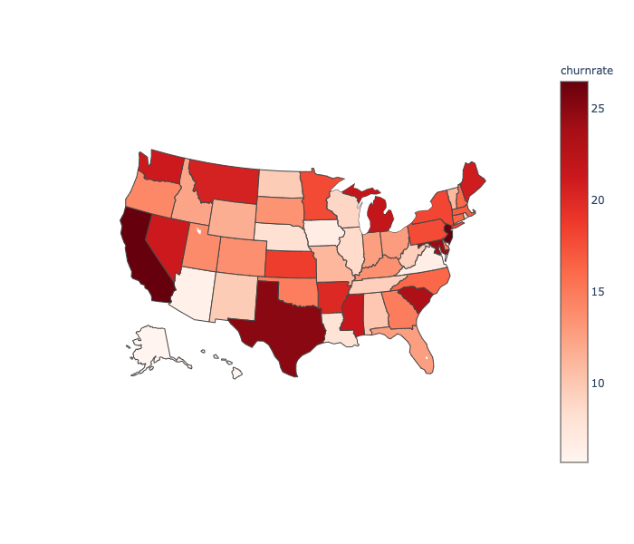
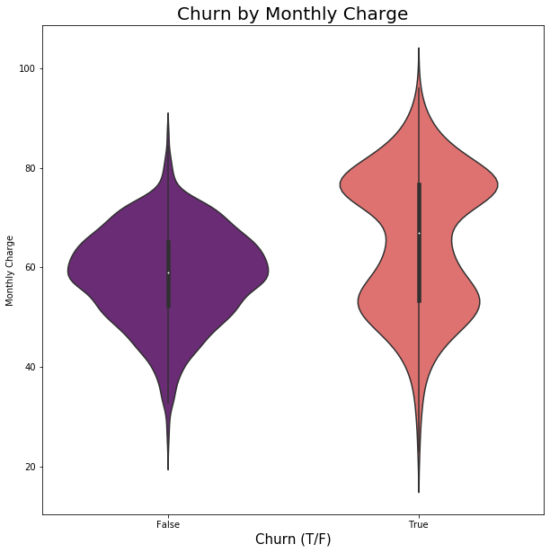
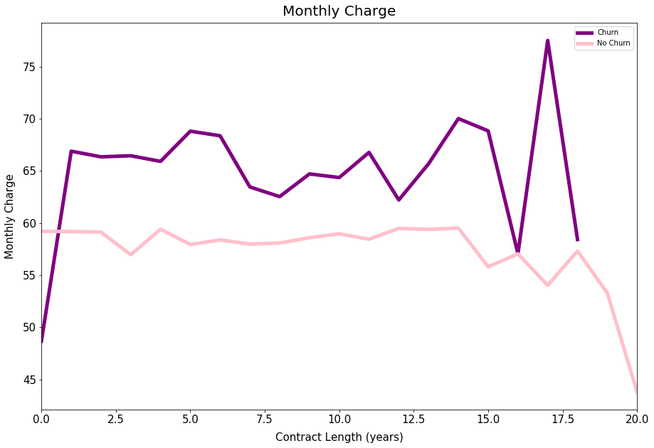
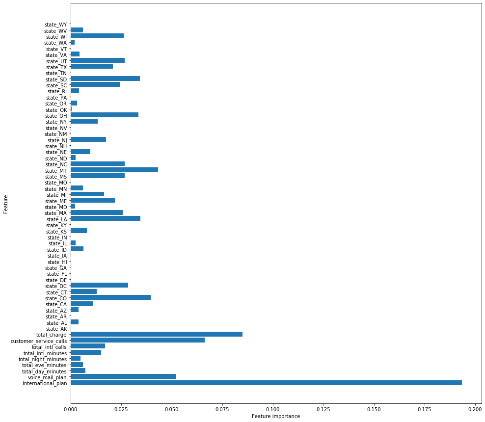
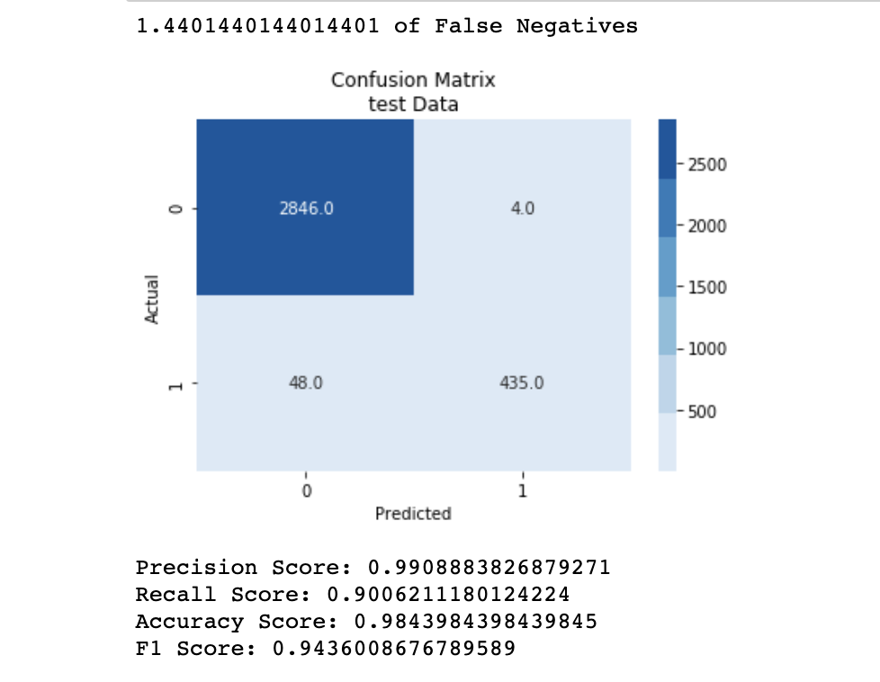

# Customer Churn Prediction and Prevention


<h2>What is Churn</h2>
Predicting and preventing customer churn represents a huge additional potential revenue source for every business.
Customer churn is when a customer ceases their relationship with a company. The full cost of churn includes both lost revenue and the marketing costs involved with replacing those customers with new ones. Reducing churn is a key business goal of every online business.

<h2>Purpose</h2>
The purpose of this repo is to help the Telecom business to predict churn in order to try and take steps to prevent these customers from leaving.

<h2>Data Description</h2>
The Repo is split up into 4 folders 

```

CLeaning&EDA:
* Data Cleaning
* Full_EDA_expansive

Data:
* churndata.csv
* CleanedData.csv
* ModelData.csv
* newdata.csv

Models:
* Final_Model.ipynb

Images:
* Contains array of images that are use in the powerpoint pdf

The Repo also contains a .py file

```

<h2> The project follows the CRISP-DM Process <h2>

<h2> Business Understanding </h2>
Customer churn refers to when a customer ceases his or her relationship with a company. The full cost of churn includes both lost revenue and the marketing costs involved with replacing those customers with new ones. 
A company that is churning customers owing to a poor pricing strategy will need a different improvement strategy than one that is churning customers due to a dysfunctional customer support program.

<h2> Data Understanding </h2>
Full EDA was performed on the dataset to further understand the problem and to explore different factors that affect churn, and similarities between customers who churn.
See 3 Questions answered 

<h4>Question 1: Does Churn Rate vary by state?</h4>
This is important to know when developing our model and strategies that location plays a part and that there will be different thresholds based on the location

New Jersey, California and Texas have the highest churn rates - 5 times higher than lowest

Hawaii, Alaska and Arizona have the lowest churn rates

<br>
 <br>
 

<br>  <br>
<h4>Question 2: Does monthly charge effct churn?</h4>
The average monthly charge for customers who remain with the company is $59, compared with $67 for customers who churn. From the below, it is clear that customers who churn come in on a cheap plan, approx $50 per month, which after a year jumps up to $65 per month. This would lead us to believe that these customers come in on some sort of promotional plan. Compared with customers who remain with the company, the average charge stays very constant





<br>   <br>
<h4>Question 3: Do Add-ons affect churn?</h4>
Nearly 50% of customers who have an international plan terminate their contract. This shows that customers are very unhappy with this plan.

<br>  <br>
 


<h2> Data Preparation</h2>
Very little data preparation was needed. The dataset had no missing values or duplicates. Redundant columns were dropped and some extra columns added.

<h2> Modelling </h2>
Multiple Models were ran. The final features chosen were run against a Logisitic Regression model, Random Forest, Bayes and XGBoost model. XGBoost performed the best.

The following features were included in the model:
* international_plan
* voice_mail_plan
* total_day_minutes 
* total_eve_minutes
* total_night_minutes
* total_intl_minutes
* total_intl_calls
* customer_service_calls
* total_charge
* state

The most important features of our model were as follows:
* State
* International Plan
* Total Charge
* Customer Service Calls
* Voicemail Plan



<h2> Evaluation </h2>


The model correctly identified 90% of churn. False Negatives accounted for 1.4% of data. That is , we said they would not churn but they did in fact churn. On closer inspection, many of these values were misclassified because they didn’t fit the general mould of our model:
* International plan
* High Total Charge
* More than 3 customer service calls
This could mean that their churn is not business related at all - and more down to personal circumstance - which we cannot account for.
Alternatively, we need to expand our model to find more segments that cause churn


<h2>Future Work</h2>
<ol>
<li>More Data - Gather more information about customers
    <ul> When the contract started </ul>
    <ul> Monthly data to see fluctuations</ul>
    <ul> Customer information - Age, Gender, etc</ul>
    </li>

<li>Customer Segmentation  - More in-depth anlaysis on customer segmentation </li>
<li>Explore Add-On combinations</li>
 <ul> Specifically why International plans have such a high attrition rate</ul>
 <li>Competitor Analysis</li>
  <ul> SWOT Analysis</ul>
</ol>

